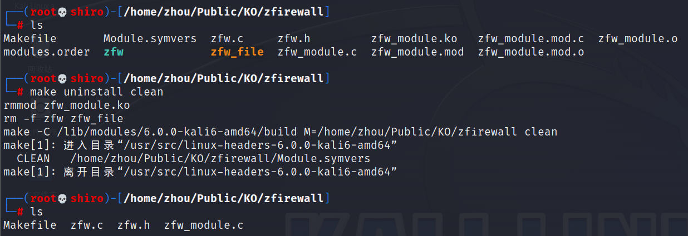

# zFirewall


## 钩子


Netfilter 钩子类型

1. **`NF_INET_PRE_ROUTING`：**
   - 钩子类型：入站处理前（在完整性校验之后、选路确定之前）
   - 位置：链路层 -> 网络层 -> 传输层 -> 钩子处理
   - 用途：允许在数据包到达本机之前进行处理。
2. **`NF_INET_LOCAL_IN`：**
   - 钩子类型：本地输入处理（在数据包到达本机后，进入本地主机之前）
   - 位置：链路层 -> 网络层 -> 传输层 -> 钩子处理
   - 用途：允许在数据包到达本机后、进入本地主机之前进行处理。
3. **`NF_INET_FORWARD`：**
   - 钩子类型：转发处理（在数据包被转发到另一台主机之前）
   - 位置：链路层 -> 网络层 -> 传输层 -> 钩子处理
   - 用途：允许在数据包被转发到另一台主机之前进行处理。
4. **`NF_INET_LOCAL_OUT`：**
   - 钩子类型：本地输出处理（在数据包离开本机之前）
   - 位置：链路层 -> 网络层 -> 传输层 -> 钩子处理
   - 用途：允许在数据包离开本机之前进行处理，通常用于出站处理。
5. **`NF_INET_POST_ROUTING`：**
   - 钩子类型：出站处理后（在数据包离开本机之后）
   - 位置：链路层 -> 网络层 -> 传输层 -> 钩子处理
   - 用途：允许在数据包离开本机之后进行处理。
6. **`NF_INET_NUMHOOKS`：**
   - 钩子类型：最大钩子类型的数量，用于辅助目的。
   - 位置：无特定位置，用于辅助目的。

## module程序


## 运行


```bash
make
```


```bash
dmesg #查看开机信息
```


**显示帮助界面**


移除内核模块

```bash
make uninstall clean
```




